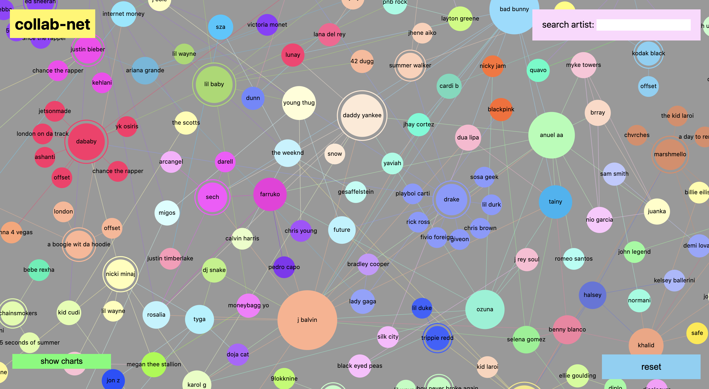

# collab-net
## an interactive network visual of Billboard 100 artist collaborations  
\
  
\
View the app on Heroku [here](https://collab-net.herokuapp.com/). Note, I am using a free dyno that automatically sleeps after no one reaches it for some time, so you may need to wait a few seconds for the page to load.

## about
<p> These days artist collaborate on songs more than ever, especially in pop and hip hop where a feature can drastically increase your song's reach. This charts shows a web of all Billboard 100 artists (starting from 2019). The bigger the artist node, the bigger their influence, ie number of collaborations. </p>
<p> Hover over an artist to see the charting songs in the bottom left corner. Click on an artist to see only their network of collaborations. </p>

## how it works
The data is scraped from the [Ultimate Music Database](http://www.umdmusic.com/) using Python, BeautifulSoup, and multiprocessing (to speed up scraping). This happens daily via an automated job via Heroku Scheduler. The data is then available in a public Google Storage bucket. A basic http server displays this data via an [AM Charts force directed network](https://www.amcharts.com/demos/force-directed-network/)

## run locally
```
pip install -r requirements.txt
python data/full_build.py  # run scraping and data formatting

npm install
http-server -o --cors  # run local server
```

## ideas?
Let me know what features you would like to see in this tool.